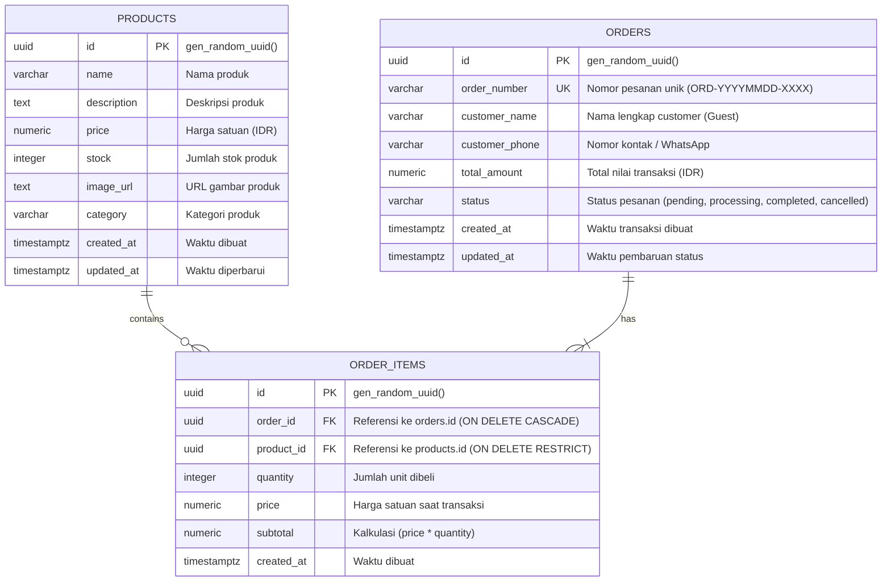

# Entity Relationship Diagram (ERD)

## Mini E-Commerce & Realtime Dashboard

Dokumen ini mendefinisikan struktur database dan relasi antar tabel pada sistem aplikasi **GearFlow**.

---

## 1. Visual ERD (Mermaid)

---

## 2. Definisi Struktur Tabel

### 2.1 Tabel `products`
Menyimpan data master produk yang tersedia di etalase toko.
- `id` (UUID, Primary Key): Identitas unik produk.
- `name` (VARCHAR): Nama produk.
- `description` (TEXT): Deskripsi detail spesifikasi produk.
- `price` (NUMERIC): Harga produk dalam Rupiah.
- `stock` (INTEGER): Kuantitas stok produk yang tersedia.
- `image_url` (TEXT): URL gambar thumbnail produk.
- `category` (VARCHAR): Kategori produk (Peripherals, Display, Audio, Accessories).
- `created_at` / `updated_at` (TIMESTAMPTZ): Jejak waktu pembuatan & pembaruan data.

### 2.2 Tabel `orders`
Menyimpan data induk transaksi yang dibuat oleh customer melalui alur *Guest Checkout*.
- `id` (UUID, Primary Key): Identitas unik order.
- `order_number` (VARCHAR, Unique): Nomor nota/faktur transaksi format `ORD-YYYYMMDD-XXXX`.
- `customer_name` (VARCHAR): Nama pembeli tanpa akun.
- `customer_phone` (VARCHAR): Nomor kontak telepon/WhatsApp pembeli.
- `total_amount` (NUMERIC): Total akumulasi tagihan transaksi.
- `status` (VARCHAR): Status alur transaksi (`pending`, `processing`, `completed`, `cancelled`).
- `created_at` / `updated_at` (TIMESTAMPTZ): Waktu transaksi dibuat dan diupdate.

### 2.3 Tabel `order_items`
Menyimpan rincian setiap jenis produk dan kuantitas yang dipesan dalam satu transaksi (*Multi-Product Ordering*).
- `id` (UUID, Primary Key): Identitas unik baris item.
- `order_id` (UUID, Foreign Key): Terhubung ke `orders.id`.
- `product_id` (UUID, Foreign Key): Terhubung ke `products.id`.
- `quantity` (INTEGER): Jumlah produk yang dibeli.
- `price` (NUMERIC): Harga satuan produk pada saat transaksi terjadi (*historical price*).
- `subtotal` (NUMERIC): Hasil kali dari `quantity * price`.
- `created_at` (TIMESTAMPTZ): Waktu item dicatat.

---

## 3. Aturan Relasi & Integritas Data
1. **One-to-Many (`orders` -> `order_items`)**: Satu pesanan dapat memuat lebih dari satu jenis produk (*multi-product order*).
2. **Many-to-One (`order_items` -> `products`)**: Banyak item pesanan merujuk ke satu data produk master.
3. **Cascade Delete**: Jika transaksi pada `orders` dihapus, seluruh detail rincian `order_items` yang bersangkutan ikut terhapus secara otomatis (`ON DELETE CASCADE`).
4. **Restrict Delete**: Data master pada `products` tidak dapat dihapus jika sudah pernah dipesan pada transaksi sebelumnya (`ON DELETE RESTRICT`).
