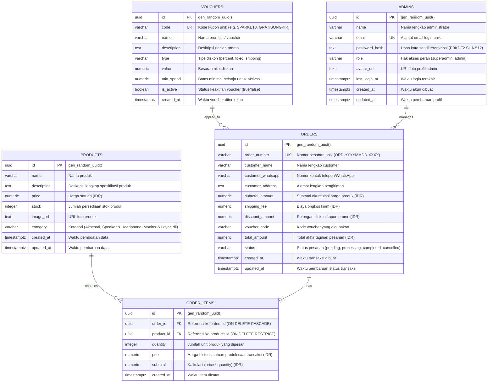

# Entity Relationship Diagram (ERD)

## Mini E-Commerce & Realtime Dashboard — Sparke

Dokumen ini mendefinisikan struktur basis data, tipe data, indeks, serta relasi antar tabel pada sistem aplikasi **Sparke**.

---

## 1. Visual ERD (Mermaid)

---

## 2. Definisi Struktur Tabel

### 2.1 Tabel `products`
Menyimpan master data produk elektronik dan aksesori yang dipajang pada etalase toko.
- `id` (UUID, Primary Key): Identitas unik produk (default: `gen_random_uuid()`).
- `name` (VARCHAR(255), Not Null): Nama produk.
- `description` (TEXT): Rincian spesifikasi, dimensi, dan fitur produk.
- `price` (NUMERIC(12,2), Not Null, Default 0): Harga jual satuan dalam Rupiah.
- `stock` (INTEGER, Not Null, Default 0): Jumlah sisa unit produk di gudang.
- `image_url` (TEXT): Tautan URL foto visual produk.
- `category` (VARCHAR(100), Default 'Aksesori'): Kategori resmi produk (`Aksesori`, `Speaker & Headphone`, `Monitor & Layar`, `Penyimpanan & Memori`, `Perangkat Pintar`).
- `created_at` (TIMESTAMPTZ, Default NOW()): Waktu pembuatan data.
- `updated_at` (TIMESTAMPTZ, Default NOW()): Waktu terakhir data produk diubah.

### 2.2 Tabel `vouchers`
Menyimpan konfigurasi kupon diskon dan potongan harga promosi.
- `id` (UUID, Primary Key): Identitas unik voucher.
- `code` (VARCHAR(50), Unique, Not Null): Kode promo alfanumerik huruf kapital (e.g. `SPARKE10`, `HEMAT50`, `GRATISONGKIR`).
- `name` (VARCHAR(255), Not Null): Judul voucher yang tampil pada keranjang belanja.
- `description` (TEXT): Keterangan syarat dan ketentuan voucher.
- `type` (VARCHAR(50), Not Null): Skema diskon (`percent`, `fixed`, `shipping`).
- `value` (NUMERIC(12,2), Not Null, Default 0): Nilai potongan (% atau nominal Rp).
- `min_spend` (NUMERIC(12,2), Default 0): Syarat minimum nominal transaksi.
- `is_active` (BOOLEAN, Default true): Status ketersediaan kupon.
- `created_at` (TIMESTAMPTZ, Default NOW()): Waktu penerbitan voucher.

### 2.3 Tabel `orders`
Menyimpan induk data pesanan customer melalui alur checkout instan tanpa login (*Instant Checkout*).
- `id` (UUID, Primary Key): Identitas unik transaksi.
- `order_number` (VARCHAR(100), Unique, Not Null): Nomor nota/faktur transaksi berformat `ORD-YYYYMMDD-XXXX`.
- `customer_name` (VARCHAR(255), Not Null): Nama lengkap pembeli.
- `customer_whatsapp` (VARCHAR(50)): Nomor kontak WhatsApp/telepon pembeli.
- `customer_address` (TEXT): Alamat lengkap pengiriman kurir.
- `subtotal_amount` (NUMERIC(12,2), Default 0): Total harga kotor produk.
- `shipping_fee` (NUMERIC(12,2), Default 0): Tarif ongkos kirim.
- `discount_amount` (NUMERIC(12,2), Default 0): Nilai potongan voucher promo yang digunakan.
- `voucher_code` (VARCHAR(100)): Kode kupon diskon yang diaplikasikan pada transaksi.
- `total_amount` (NUMERIC(12,2), Not Null, Default 0): Total bersih yang wajib dibayar.
- `status` (VARCHAR(50), Default 'pending'): Status transaksi (`pending`, `processing`, `completed`, `cancelled`).
- `created_at` (TIMESTAMPTZ, Default NOW()): Waktu pesanan dibuat oleh customer.
- `updated_at` (TIMESTAMPTZ, Default NOW()): Waktu perubahan status transaksi terakhir.

### 2.4 Tabel `order_items`
Menyimpan rincian setiap jenis barang, kuantitas, dan harga transaksi pada pesanan (*Multi-Product Ordering*).
- `id` (UUID, Primary Key): Identitas unik baris item transaksi.
- `order_id` (UUID, Foreign Key, Not Null): Terhubung langsung ke `orders.id` (`ON DELETE CASCADE`).
- `product_id` (UUID, Foreign Key, Not Null): Terhubung ke `products.id` (`ON DELETE RESTRICT`).
- `quantity` (INTEGER, Not Null, Default 1): Jumlah kuantitas produk yang dibeli.
- `price` (NUMERIC(12,2), Not Null, Default 0): Harga satuan produk saat transaksi terjadi (*snapshot price*).
- `subtotal` (NUMERIC(12,2), Not Null, Default 0): Hasil kalkulasi `quantity * price`.
- `created_at` (TIMESTAMPTZ, Default NOW()): Waktu pencatatan item pesanan.

### 2.5 Tabel `admins`
Menyimpan data identitas kredensial pengelola toko dan hak akses panel kontrol administrator.
- `id` (UUID, Primary Key): Identitas unik administrator.
- `name` (VARCHAR(255), Not Null): Nama lengkap administrator.
- `email` (VARCHAR(255), Unique, Not Null): Alamat email login akun admin.
- `password_hash` (TEXT, Not Null): Hash keamanan kata sandi terenkripsi (PBKDF2 SHA-512 dengan salt acak).
- `role` (VARCHAR(50), Default 'admin'): Tingkat hak akses (`superadmin`, `admin`).
- `avatar_url` (TEXT): Tautan URL foto profil akun admin.
- `last_login_at` (TIMESTAMPTZ): Jejak waktu login terakhir admin ke dashboard.
- `created_at` (TIMESTAMPTZ, Default NOW()): Waktu akun dibuat.
- `updated_at` (TIMESTAMPTZ, Default NOW()): Waktu terakhir profil diubah.

---

## 3. Aturan Relasi & Integritas Data

1. **One-to-Many (`orders` &rarr; `order_items`)**: Satu pesanan (`orders`) dapat menampung banyak jenis produk sekaligus (`order_items`).
2. **Many-to-One (`order_items` &rarr; `products`)**: Banyak item pesanan mereferensikan satu produk master pada katalog.
3. **Optional Association (`vouchers` &rarr; `orders`)**: Kolom `orders.voucher_code` mereferensikan kode kupon aktif yang digunakan saat proses pembayaran.
4. **Cascade Delete (`orders` &rarr; `order_items`)**: Apabila pesanan pada tabel `orders` dihapus, seluruh detail rincian `order_items` yang bersangkutan akan otomatis terhapus (`ON DELETE CASCADE`).
5. **Restrict Delete (`products` &rarr; `order_items`)**: Produk master pada tabel `products` tidak dapat dihapus sembarangan jika terdapat riwayat transaksi yang masih mengikat data tersebut (`ON DELETE RESTRICT`).
6. **Supabase Realtime Replication**: Seluruh tabel (`orders`, `order_items`, `products`, `vouchers`, `admins`) terdaftar dalam publikasi `supabase_realtime` untuk replikasi data instan ke antarmuka client.
