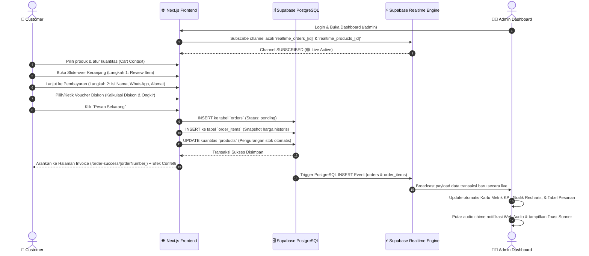
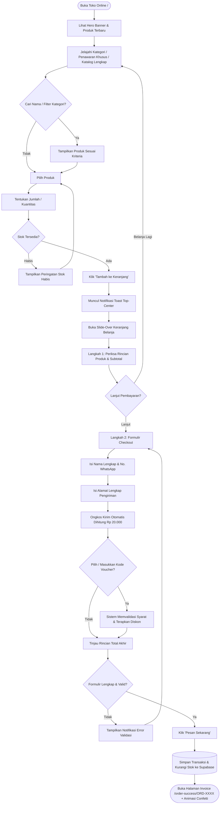

# System Flowchart & User Flow

## Mini E-Commerce & Realtime Dashboard — Sparke

Dokumen ini menjelaskan arsitektur alur kerja sistem (*System Architecture Flow*), alur belanja pengguna customer (*Customer Checkout Flow*), serta alur pengoperasian dashboard administrator (*Admin Workflow*).

---

## 1. Alur Transaksi & Sinkronisasi Realtime (System Architecture Flow)



---

## 2. Customer User Flow (Storefront & Checkout)



---

## 3. Administrator Workflow (Realtime Dashboard & Management)

```mermaid
flowchart TD
    AdminStart([Akses URL /admin]) --> CheckSession{Memiliki Sesi Aktif?}
    CheckSession -- Belum --> LoginView[Halaman Login /admin/login]
    LoginView --> InputAuth[Input Email & Password / Demo Quick Access]
    InputAuth --> VerifyAuth[(Verifikasi PBKDF2 & Set Signed Cookie Token)]
    VerifyAuth --> CheckSession
    
    CheckSession -- Ya --> DashboardHome[Buka Dashboard Ringkasan /admin]
    DashboardHome --> ConnectRealtime[Hubungkan Supabase Realtime Channels]
    
    ConnectRealtime --> ListenOrders[Mendengarkan Event Pesanan Baru]
    ListenOrders --> OnNewOrder{Ada Pesanan Baru Masuk?}
    OnNewOrder -- Ya --> UpdateUI[Update Realtime: KPI Revenue, Grafik Recharts, & Tabel]
    UpdateUI --> SoundToast[Putar Audio Notifikasi Chime & Toast Pop-up]
    SoundToast --> ListenOrders
    
    DashboardHome --> NavChoice{Pilih Menu Navigasi Admin}
    
    NavChoice -- Kelola Pesanan --> OrdersPage[/admin/orders]
    OrdersPage --> FilterOrders[Filter Status / Cari Nomor Pesanan]
    FilterOrders --> OrderDetail[Buka Rincian Pesanan & Item]
    OrderDetail --> ChangeStatus[Ubah Status: Pending / Diproses / Selesai / Dibatalkan]
    ChangeStatus --> SaveStatus[(Update Status Transaksi di Database)]
    SaveStatus --> OrdersPage

    NavChoice -- Katalog Produk --> ProductsPage[/admin/products]
    ProductsPage --> ProductActions{Aksi Produk}
    ProductActions -- Tambah Baru --> NewProduct[/admin/products/new]
    ProductActions -- Edit Produk --> EditProduct[/admin/products/id]
    NewProduct --> SaveProduct[(Simpan Master Produk dengan Dropdown Kategori)]
    EditProduct --> SaveProduct
    SaveProduct --> ProductsPage

    NavChoice -- Voucher & Promo --> VouchersPage[/admin/vouchers]
    VouchersPage --> VoucherActions{Aksi Voucher}
    VoucherActions -- Tambah Voucher --> NewVoucher[/admin/vouchers/new]
    VoucherActions -- Edit Voucher --> EditVoucher[/admin/vouchers/id]
    NewVoucher --> SaveVoucher[(Simpan Voucher dengan Dropdown Tipe & Status)]
    EditVoucher --> SaveVoucher
    SaveVoucher --> VouchersPage

    NavChoice -- Pengaturan Akun --> SettingsPage[/admin/settings]
    SettingsPage --> UpdateProfile[Ubah Nama, Email, Foto Avatar, atau Ganti Kata Sandi]
    UpdateProfile --> SaveProfile[(Simpan Profil & Perbarui Sesi Admin)]
    SaveProfile --> BroadcastProfile[Event Realtime Update Profil di Seluruh UI Sidebar]
```
