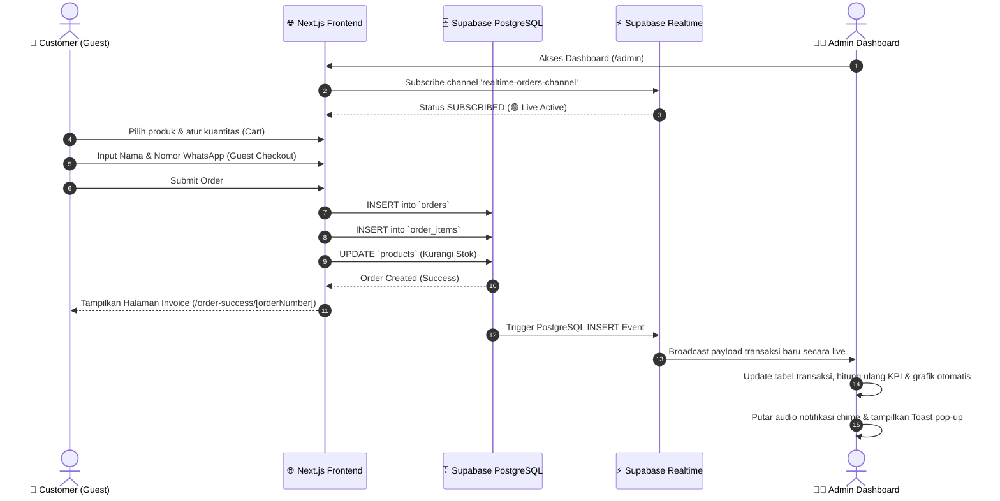
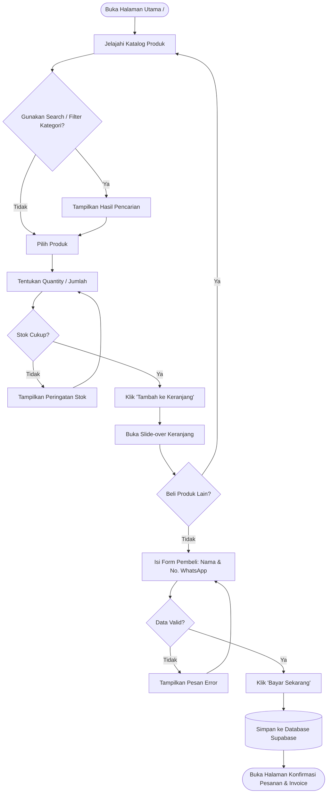
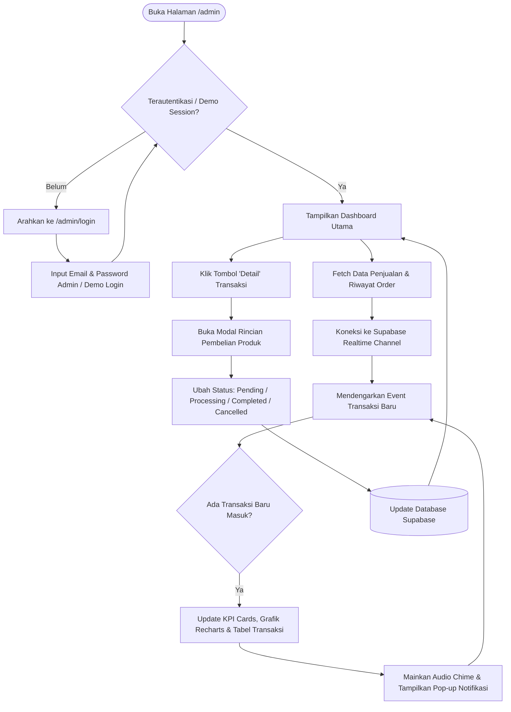

# System Flowchart & User Flow

## Mini E-Commerce & Realtime Dashboard

Dokumen ini menjelaskan alur kerja sistem (*System Architecture Flow*), alur pengguna customer (*Customer Flow*), serta alur administrator (*Admin Flow*).

---

## 1. Alur Transaksi & Sinkronisasi Realtime (System Flow)

---

## 2. Customer User Flow (Guest Checkout)

---

## 3. Admin User Flow (Realtime Monitoring)

